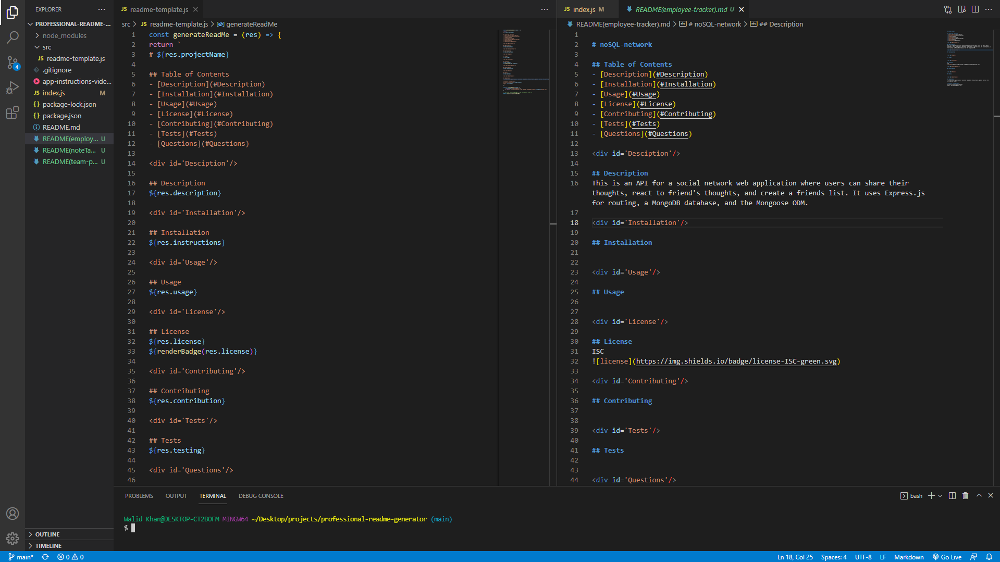

# Professional README Generator

## Table of Contents
- [Description](#Description)
- [Installation](#Installation)
- [Usage](#Usage)
- [License](#License)
- [Questions](#Questions)

## Description
Generator which creates README.md files for web development projects based on user's requirements.

## Installation
In order to install this application, please clone this repository, install the dependencies by running 'npm i' in the terminal, and run 'node index' from the programs root directory.

## Usage
For project usage instructions watch this video:  
[Professional Readme Generator Walkthrough video](https://www.youtube.com/watch?v=_Ew0LdtDh3Y)

## License       
UNLICENSED  

## Questions
For additional questions or concerns regarding this project, please contact the information below:

**Contact information**  
GitHub: github.com/walidhkhan  
Email: walidhkhan@gmail.com
